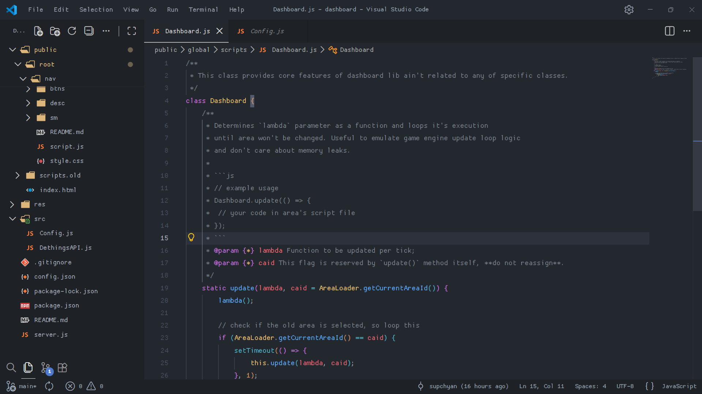

### Prereq
Install [extensitons](./ext) and [fonts](./fonts/).

### About `settings.json`
For Windows OS move `settings.json` to `C:\Users\your_username\AppData\Roaming\Code\User`.

Don't forget about backup your original `settings.json`.

### Modify GUI font with `customvscodeuicss`
`Ctrl + Shift + P` -> `>customvscodeuicss: Reload Configuration` -> `Restart vscode`.

It supports EN / RU / JP characters.

### Showcase

  

